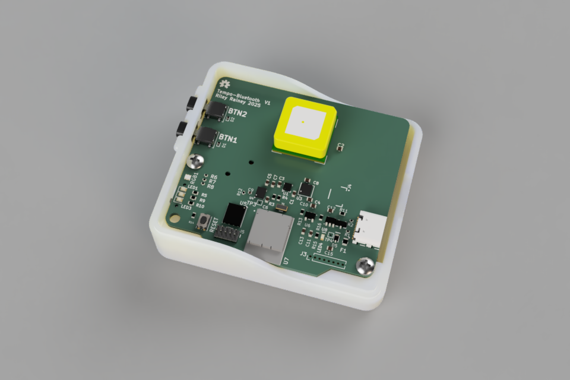
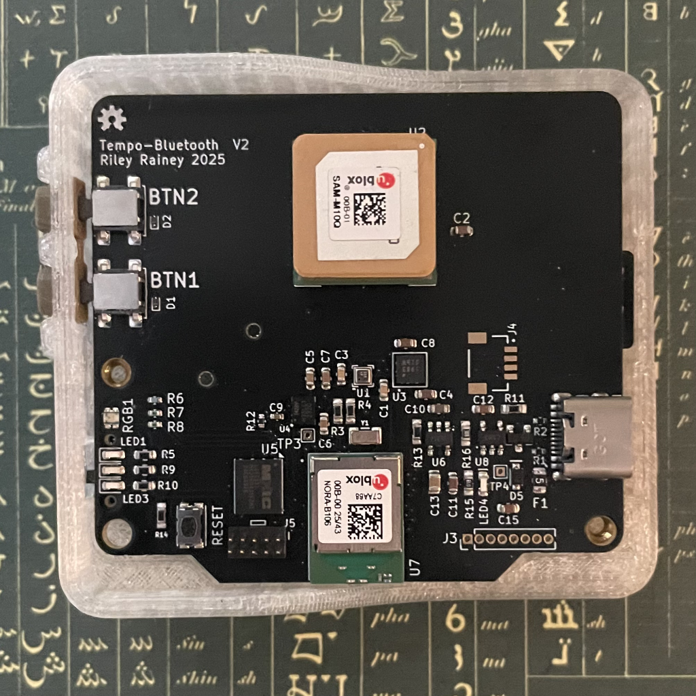

# Tempo-BT

Tempo-BT is the Bluetooth-LE-capable version of the Tempo skydiving logger device.  It is based on the u-blox NORA-B106 (Nordic Semiconductor nRF5340).

### Sensors and Capabilities

- GPS/GNSS position tracking using a u-blox SAM-M10Q
- 6-DOF Inertial measurement / gyro pose tracking using a TDK InvenSense ICM-42688-V
- Barometric pressure / temperature logging using a Bosch BPM390
- 3-DOF Compass/Magnetic measurement using a Memsic MMC5983MA (not utilized in the current version of the project)

## Directory Structure

| Folder               | Description |
| -------------------- | ----------- |
| hardware             | KiCad PCB project (using KiCad 9)    |
| enclosure            | 3D-printable enclosure and assembly instructions (Fusion360 format) |
| zephyr/tempo-bt-v1   | Nordic nRF Connect SDK (Zephyr) firmware |

## LiPo Powered
The device is designed to use a 3.7V 850mAh rated USB-rechargeable battery.  Testing demonstrates the device and current firmware combination consumes 14.8 milliamps in idle mode and 17.4 milliamps in jump logging mode. Although I'd suggest power-cycling the device between jumps, this design should easily allow for two days of continuous use.

## Enclosure

The enclosure is designed to be SLA printable. 

