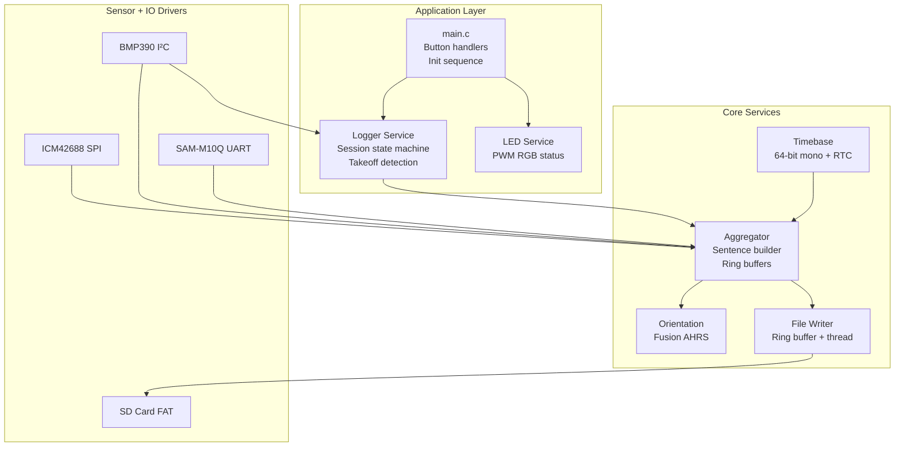
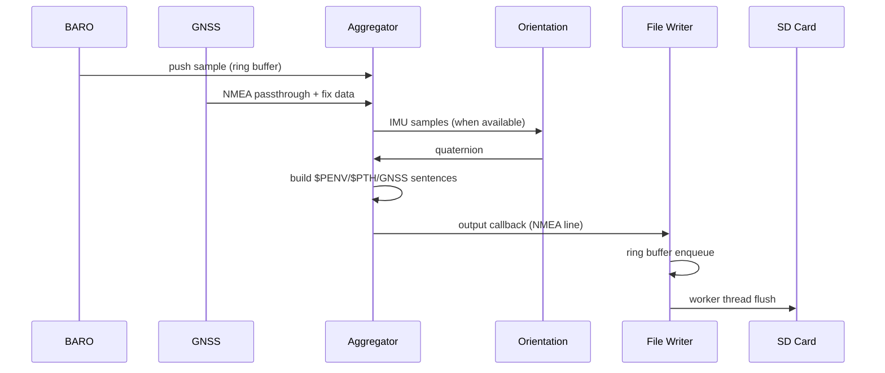
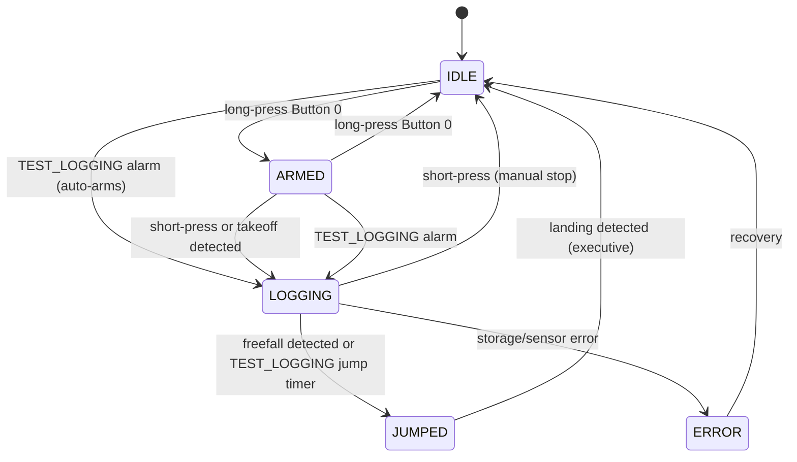

# Tempo-BT (V1) — Zephyr Device Application Architecture

> Scope: architecture for the **V1 prototype** (nRF5340 / NORA-B106) with ICM-42688-V (SPI), BMP390 (I²C), optional MMC5983MA (I²C), u-blox SAM-M10Q (UART), **SD Card** (FAT/exFAT).
> Focus areas per request:
>
> 1. **File + folder (project) structure**
> 2. **What each part does**
> 3. **Where state lives & how services connect**

---

## 1) Project Layout (top-level folders and key files)

```
tempo-bt/
├─ CMakeLists.txt                # Zephyr app build entry
├─ prj.conf                      # Kconfig: features, stacks, logging, BLE, FS
├─ Kconfig                       # (optional) app-specific config symbols
├─ west.yml                      # (optional) NCS/Zephyr manifest pinning
│
├─ boards/
│  └─ nrf5340dk_nrf5340/
│     ├─ tempo_v1.overlay        # DeviceTree overlay: pins/buses/IRQs for V1
│     └─ tempo_v1.conf           # Board-specific prj.conf deltas (if needed)
│
├─ include/
│  ├─ app/events.h               # Event IDs, payloads, and helper macros
│  ├─ app/log_format.h           # $Pxxx sentence format & helpers (NMEA)
│  │
│  ├─ services/timebase.h        # Time service API (monotonic, GNSS tie)
│  ├─ services/imu.h             # ICM42688 sample structs & API
│  ├─ services/baro.h            # BMP390 sample structs & API
│  ├─ services/gnss.h            # GNSS NMEA/UBX ingest API
│  ├─ services/aggregator.h      # Merges streams → record/sentence builder
│  ├─ services/logger.h          # Logging session lifecycle & policies
│  ├─ services/file_writer.h     # Async buffered writer (ring buffer)
│  ├─ services/storage.h         # Storage abstraction (littlefs/FATFS)
│  ├─ services/orientation.h     # AHRS/orientation tracking API
│  ├─ services/led.h             # RGB LED service API
│  │
│  └─ fusion.h                   # Fusion AHRS algorithm headers
│
├─ src/
│  ├─ main.c                     # Init order, button handling, event loop
│  ├─ app_init.c                 # Storage mount, BLE/mcumgr initialization
│  ├─ events.c                   # Event bus (k_fifo/k_msgq) + subscribers
│  ├─ fusion.c                   # Fusion AHRS algorithm (xioTechnologies)
│  │
│  ├─ services/
│  │  ├─ timebase.c             # 64-bit mono clock; GNSS time correlation
│  │  ├─ imu_icm42688.c         # SPI4 + INT1/FIFO DMA; ODR control
│  │  ├─ baro_bmp390.c          # I²C + DRDY; pressure/temperature
│  │  ├─ gnss_m10q.c            # UART async; NMEA/UBX parse; early quiet
│  │  ├─ aggregator.c           # Streams → `$PIMU/$PIM2/$PENV/...` w/ checksums
│  │  ├─ orientation.c          # AHRS wrapper using Fusion algorithm
│  │  ├─ logger.c               # Session mgmt; start/stop; takeoff detection
│  │  ├─ file_writer.c          # Ring buffer + worker thread
│  │  ├─ storage.c              # Storage abstraction layer
│  │  ├─ storage_littlefs.c     # QSPI NOR backend (optional)
│  │  ├─ storage_fatfs.c        # SD Card FAT/exFAT backend (primary)
│  │  └─ led.c                  # PWM-based RGB LED control
│  │
│  └─ util/
│     └─ nmea_checksum.c        # NMEA checksum utilities
│
├─ config/
│  └─ settings.c                 # Zephyr settings keys & defaults (`app/*`)
│
├─ docs/
│  └─ mvp-architecture.md        # This document
│
└─ scripts/
   └─ host_tools/verify_log.py   # PC-side log validator
```

---

## 2) Runtime Architecture (what each part does)

### 2.1 Layered view

**Current implementation status:**
- ✓ BMP390 barometer (working, 8Hz with takeoff detection)
- ✓ GNSS SAM-M10Q (working, 1-10Hz dynamic, UBX config)
- ✓ SD Card storage (FAT/exFAT, primary storage)
- ✓ Orientation tracking (Fusion AHRS algorithm)
- ✓ RGB LED status (PWM-based, state indication)
- ✓ Button controls (short/long press handling)
- ✓ BLE file transfer (mcumgr)
- ✗ ICM42688 IMU (hardware issues - WHO_AM_I mismatch)
- ✗ MMC5983MA magnetometer (not integrated)



### 2.2 Concurrency model (threads & priorities)

| Thread | Priority | Purpose |
|--------|----------|---------|
| **File writer** | `K_PRIO_PREEMPT(10)` | Drains ring buffer to SD card |
| **Aggregator** | `K_PRIO_PREEMPT(5)` | Builds NMEA sentences |
| **GNSS RX** | `K_PRIO_PREEMPT(5)` | UART async callback context |
| **Main** | Default | Button handling, health monitoring |

**Communication primitives:**

* **Ring buffer** (Zephyr `sys/ring_buffer.h`) in file_writer for async I/O
* **Spinlock-protected ring buffers** in aggregator for IMU/BARO/GNSS samples
* **Event bus** (`k_fifo`/`k_msgq`) for state change notifications
* **Mutexes** for thread-safe stats access and orientation state

---

## 3) Where State Lives

### 3.1 Persistent configuration (NVS / `settings`)

* Stored via Zephyr `settings` in internal flash
* Loader in `config/settings.c`
* Keys include BLE name, rate settings

### 3.2 System state (RAM, owned by logger service)

* **Logger state** (`logger_state_t`) serves as the primary system state:
  * States: `IDLE` → `ARMED` → `LOGGING` → `JUMPED` → `POSTFLIGHT` → `ERROR`
  * Manages session lifecycle and health metrics
  * Thread-safe access via mutex

* **Test alarm state** (in `mcumgr_custom.c`):
  * States: `TEST_ALARM_IDLE`, `TEST_ALARM_WAITING_START`, `TEST_ALARM_WAITING_JUMP`
  * Target UTC time and jump delay parameters
  * Processed by `timebase.c` on each PPS pulse

* **Sensor caches** (in respective services):
  * **BARO**: last pressure/temp, altitude estimate, ground reference
  * **GNSS**: last fix (position, velocity, time), RTC correlation
  * **Orientation**: current quaternion (Fusion AHRS state)

* **Session state** (in logger, lifetime = active logging session):
  * `session_start_us` (monotonic timestamp)
  * `session_dir` (path to session directory)
  * File writer statistics (bytes, lines, flushes)

### 3.3 Filesystem state

* **Primary**: SD Card with FAT/exFAT filesystem
* **Fallback**: QSPI NOR with littlefs (optional)
* **Path scheme**: `/SD:/logs/<YYYYMMDD>/<UUID>.txt`
* **Date folders**: Created using GPS date when available

---

## 4) Services — Responsibilities & Interfaces

### 4.1 `timebase`

* Provides `time_now_us()` (64-bit monotonic)
* Maintains GNSS time correlation: updated by GNSS sentences
* Sets system RTC (`CLOCK_REALTIME`) from GPS time for date-stamped directories
* **PPS (Pulse Per Second)**: Handles GNSS 1Hz time pulse interrupt for precise timing
* **ISO 8601 datetime**: `timebase_get_utc_iso8601()` returns current UTC as `YYYY-MM-DDTHH:MM:SS.dZ`
* **Test alarm processing**: PPS-triggered work handler for synchronized multi-device testing

### 4.2 `imu_icm42688`

* Configures ODR, full-scale ranges; enables FIFO + INT1
* SPI bursts on INT; enqueues batches to aggregator ring buffer
* **Status**: Hardware issues (WHO_AM_I mismatch) - not functional on current boards

### 4.3 `baro_bmp390`

* Configures ODR (default 8 Hz); fires on DRDY IRQ
* Outputs pressure, temperature, and calculated altitude
* Provides ground altitude reference for takeoff detection
* Callback registration for logger (takeoff detection) and aggregator (logging)

### 4.4 `gnss_m10q`

* **UART async API** with ring buffer for received data
* **Early quiet**: `gnss_early_quiet()` called at boot to silence module before full init
* **NMEA parsing**: GGA, GLL, VTG sentences passed through to log
* **UBX protocol**: Configuration commands (rate, dynamic model, message enable/disable)
* **Dynamic model**: Airborne 4g for skydiving operations
* **Rate control**: 1 Hz default, configurable up to 10 Hz

### 4.5 `orientation` + `fusion`

* **Fusion AHRS algorithm** (based on xioTechnologies/Fusion library)
* IMU-only operation (no magnetometer)
* Outputs quaternion orientation updated from IMU samples
* Configurable gain and acceleration rejection thresholds

### 4.6 `aggregator`

* **Ring buffers** for IMU (128 samples), BARO (32 samples), GNSS (32 fixes)
* **NMEA sentence builder** with checksum calculation
* **Output sentences**:
  * `$PVER` - Version info at session start
  * `$PSFC` - Surface/ground altitude
  * `$PIMU` - IMU data (50 Hz when IMU working)
  * `$PIM2` - Quaternion orientation (after each `$PIMU`)
  * `$PENV` - Environmental data (4 Hz) - pressure, altitude, battery
  * `$PTH` - Timestamp correlation (after GGA/GLL)
  * `$PST` - State change events
  * Raw GNSS: `$GxGGA`, `$GxGLL`, `$GxVTG` passthrough
* **Work-based output**: Delayable work items for timed sentence emission

### 4.7 `logger`

* **Session state machine**: IDLE → ARMED → LOGGING → JUMPED → POSTFLIGHT → ERROR
* **Takeoff detection**: Monitors barometer for climb rate and altitude change
* **Freefall detection**: Monitors descent rate to trigger LOGGING → JUMPED transition
* **Session management**:
  * Creates date-based directories using GPS date
  * UUID-based filenames
  * Writes header (PVER, PSFC) at session start
* **Button control integration**: Armed/disarmed via long press, start/stop via short press
* **Executive function**: Handles automatic state transitions based on flight phase detection

### 4.8 `file_writer`

* **Simplified architecture**: Ring buffer + dedicated worker thread
* **Static allocations**: 8KB ring buffer, 4KB write buffer, 1KB thread stack
* **Async operation**: Data queued via `file_writer_write()`, flushed by worker
* **Periodic flush**: Default 250ms interval
* **Statistics**: Bytes written, lines, flushes, buffer overflows, write errors

### 4.9 Storage Backends

* **Primary**: `storage_fatfs.c` - SD Card with FAT/exFAT
  * Mount point: `/SD:`
  * Auto-creates directory paths
  * Card detect GPIO support
* **Optional**: `storage_littlefs.c` - QSPI NOR flash
* **Abstraction**: `storage.c` provides unified interface

### 4.10 `led`

* **PWM-based RGB LED** control (3 channels)
* **Blink pattern**: 50ms on, 2 second period
* **State colors**:
  * Blue: IDLE
  * Orange: ARMED
  * Green: LOGGING
  * Red: ERROR
* **Override support**: Temporary color override for status indication

### 4.11 BLE / mcumgr

* Standard mcumgr file transfer over BLE SMP
* File list/get/delete operations
* Dynamic device name support (`CONFIG_BT_DEVICE_NAME_DYNAMIC`)

**Custom Tempo Commands** (Group ID 64):

| ID | Command | Type | Description |
|----|---------|------|-------------|
| 0 | `SESSION_LIST` | Read | List logging sessions |
| 2 | `STORAGE_INFO` | Read | Get storage backend and free space |
| 3 | `LED_CONTROL` | Write | Set RGB LED color override |
| 4 | `LOGGER_CONTROL` | Write | Start/stop/arm/disarm logger |
| 5 | `SESSION_DELETE` | Write | Delete a logging session |
| 6 | `SETTINGS_GET` | Read | Get NVM settings (BLE name, PPS, PCB variant) |
| 7 | `SETTINGS_SET` | Write | Update NVM settings |
| 8 | `GET_DATETIME` | Read | Get current UTC as ISO 8601 (`YYYY-MM-DDTHH:MM:SS.dZ`) |
| 9 | `TEST_LOGGING` | Write | Schedule synchronized logging test (see below) |

**TEST_LOGGING Command**:

Used for multi-device synchronized testing via GNSS PPS signal.

* **Request**: `{"start": "MMSS", "jump": nn}`
  * `start`: Minutes and seconds within current UTC hour to begin logging
  * `jump`: Seconds after start to transition to JUMPED state (0-3600)
* **Response**: `{success, start_mm, start_ss, seconds_until_start, jump_delay}`
* **Behavior**:
  * Requires valid GNSS time correlation (returns error if unavailable)
  * If MMSS has passed in current hour, schedules for next hour
  * Auto-arms logger if in IDLE state
  * PPS interrupt triggers `logger_start()` at exact second boundary
  * After `jump` seconds, triggers `logger_jumped()` for state transition
  * Logger executive handles session closure after landing detection

---

## 5) How Services Connect

### 5.1 Data plane (samples → sentences → storage)



### 5.2 Control plane (events & state)

* `events.c` exposes `event_bus_publish()` and subscriber registration
* **Producers**: logger, storage, sensors
* **Consumers**: LED service (state colors), aggregator (`$PST` sentences)

**Event types:**
* `EVT_MODE_CHANGE` - Logger state transitions
* `EVT_STORAGE_ERROR` - SD card errors
* `EVT_SENSOR_ERROR` - Sensor failures
* `EVT_STORAGE_LOW` - Low storage warning

---

## 6) Session Lifecycle (state machine)



**Button Controls (main.c):**
- **Button 0 long press** (2 seconds): Toggle IDLE ↔ ARMED
- **Button 0 short press**: Start logging (when ARMED) or stop logging (when LOGGING)
- **Button 1**: Reserved for future use

**Automatic Takeoff Detection:**
- Monitors barometer climb rate and altitude change
- Triggers ARMED → LOGGING transition automatically
- Configurable via `auto_start_on_takeoff` in logger config

**Test Alarm Synchronization (mcumgr TEST_LOGGING):**
- Schedules LOGGING start at specific UTC wall clock time (MMSS within hour)
- Uses GNSS PPS signal for precise 1-second boundary triggering
- Enables simultaneous logging start across multiple Tempo-BT devices
- Optional jump delay triggers LOGGING → JUMPED transition after N seconds

Transitions emit `$PST` records with trigger reasons.

---

## 7) Logging Format

Uses **NMEA-style** `$Pxxx` proprietary sentences with checksums.

### Sentence Types

| Sentence | Rate | Description |
|----------|------|-------------|
| `$PVER` | Once | Version info: `"Tempo V1 <version> (<git>)",<numeric>` |
| `$PSFC` | Once | Surface/ground altitude in feet |
| `$PIMU` | 50 Hz | Accel (m/s²) + gyro (rad/s) - when IMU working |
| `$PIM2` | 50 Hz | Quaternion (w,x,y,z) - after each PIMU |
| `$PENV` | 4 Hz | Pressure (hPa), altitude (ft), battery (V) |
| `$PTH` | Per fix | Timestamp correlation (ms since session start) |
| `$PST` | Events | State change: old_state, new_state, trigger |
| `$GxGGA` | 1 Hz | GNSS fix (passthrough) |
| `$GxGLL` | 1 Hz | GNSS position (passthrough) |
| `$GxVTG` | 1 Hz | GNSS velocity (passthrough) |

### Checksum Format

All sentences end with `*HH\r\n` where HH is XOR checksum of characters between `$` and `*`.

---

## 8) Error Handling

* **Ring buffer overflow**: Tracked in file_writer stats; logged as warning
* **Storage errors**: Trigger `EVT_STORAGE_ERROR`; logger transitions to ERROR state
* **Sync policy**: Writer syncs after each flush; final sync on file close
* **GNSS buffer overrun**: Mitigated by `gnss_early_quiet()` at boot

---

## 9) Implementation Status

### Working
- ✓ SD Card storage (FAT/exFAT)
- ✓ BLE file transfer (mcumgr)
- ✓ BMP390 barometer (8 Hz, takeoff detection)
- ✓ SAM-M10Q GNSS (1-10 Hz, UBX config, airborne 4g mode)
- ✓ Orientation tracking (Fusion AHRS - ready for IMU)
- ✓ Logger state machine (IDLE/ARMED/LOGGING/JUMPED/ERROR)
- ✓ Button controls (short/long press)
- ✓ RGB LED status indication
- ✓ Event bus for state notifications
- ✓ Date-stamped log directories (GPS date)
- ✓ Async file writer (ring buffer + worker thread)
- ✓ Custom mcumgr commands (session/storage/LED/logger/settings control)
- ✓ PPS-synchronized test logging (multi-device synchronization)
- ✓ UTC datetime query (ISO 8601 format)

### Not Working / Pending
- ✗ ICM42688 IMU (hardware WHO_AM_I mismatch)
- ✗ MMC5983MA magnetometer (not integrated)
- ✗ Advanced flight phase detection
- ✗ Auto-landing detection

---

## 10) Key Configuration (prj.conf)

```conf
# Heap for dynamic allocations
CONFIG_HEAP_MEM_POOL_SIZE=32768

# BLE with dynamic device name
CONFIG_BT_DEVICE_NAME_DYNAMIC=y
CONFIG_BT_DEVICE_NAME_MAX=32

# Filesystem
CONFIG_FILE_SYSTEM=y
CONFIG_FAT_FILESYSTEM_ELM=y
CONFIG_DISK_ACCESS=y

# UART async for GNSS
CONFIG_UART_ASYNC_API=y
```

---

## TL;DR

* **Logger service** owns system state (IDLE → ARMED → LOGGING → JUMPED)
* **Aggregator** builds NMEA sentences from sensor ring buffers
* **File writer** uses Zephyr ring buffer + worker thread for async I/O
* **GNSS** provides position + time; PPS signal enables precise timing
* **Barometer** provides altitude + takeoff detection
* **Orientation** ready for IMU data (Fusion AHRS algorithm)
* **Button 0** controls arming (long) and start/stop (short)
* **LED** indicates state via color (blue=idle, orange=armed, green=logging, red=error)
* **mcumgr** provides BLE commands for session management, settings, and synchronized test logging
