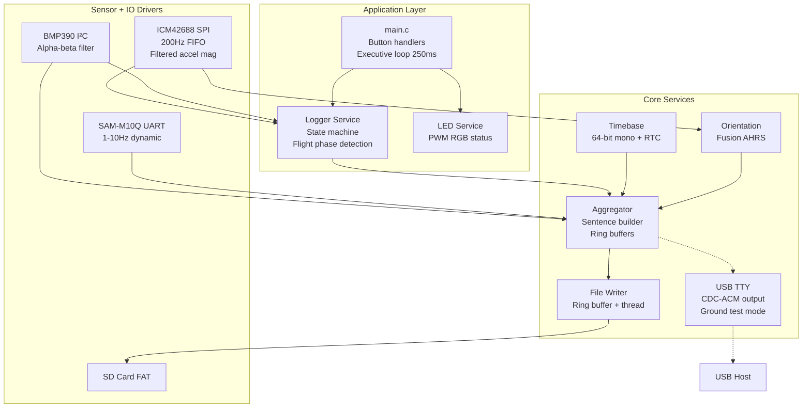
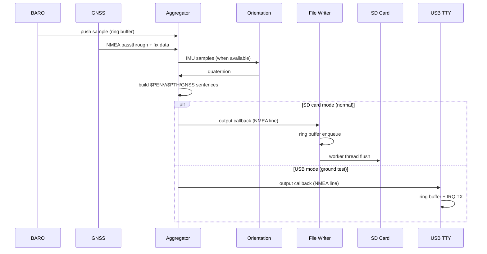
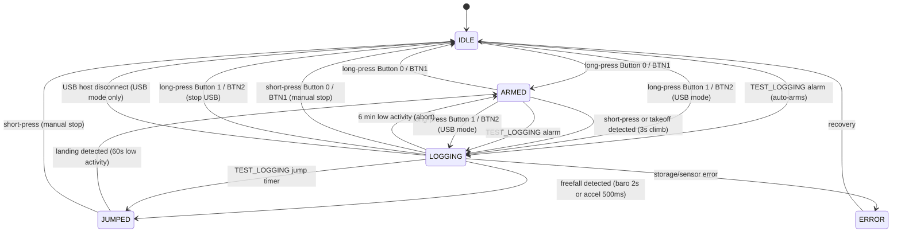

# Tempo-BT (V1) — Zephyr Device Application Architecture

> Scope: architecture for the **V1 prototype** (nRF5340 / NORA-B106) with ICM-42688-V (SPI), BMP390 (I²C), optional MMC5983MA (I²C), u-blox SAM-M10Q (UART), **SD Card** (FAT/exFAT).
> Focus areas per request:
>
> 1. **File + folder (project) structure**
> 2. **What each part does**
> 3. **Where state lives & how services connect**

---

## 1) Project Layout (top-level folders and key files)

```
tempo-bt/
├─ CMakeLists.txt                # Zephyr app build entry
├─ prj.conf                      # Kconfig: features, stacks, logging, BLE, FS
├─ Kconfig                       # App-specific config symbols (USB_TTY_OUTPUT, etc.)
├─ west.yml                      # (optional) NCS/Zephyr manifest pinning
│
├─ boards/
│  └─ nrf5340dk_nrf5340/
│     ├─ tempo_v1.overlay        # DeviceTree overlay: pins/buses/IRQs/USB for V1
│     └─ tempo_v1.conf           # Board-specific prj.conf deltas (if needed)
│
├─ include/
│  ├─ app/events.h               # Event IDs, payloads, and helper macros
│  ├─ app/log_format.h           # $Pxxx sentence format & helpers (NMEA)
│  │
│  ├─ services/timebase.h        # Time service API (monotonic, GNSS tie)
│  ├─ services/imu.h             # ICM42688 sample structs & API
│  ├─ services/baro.h            # BMP390 sample structs & API
│  ├─ services/gnss.h            # GNSS NMEA/UBX ingest API
│  ├─ services/aggregator.h      # Merges streams → record/sentence builder
│  ├─ services/logger.h          # Logging session lifecycle & policies
│  ├─ services/file_writer.h     # Async buffered writer (ring buffer)
│  ├─ services/storage.h         # Storage abstraction (littlefs/FATFS)
│  ├─ services/orientation.h     # AHRS/orientation tracking API
│  ├─ services/led.h             # RGB LED service API
│  ├─ services/usb_tty.h         # USB CDC-ACM TTY output API (ground test)
│  │
│  └─ fusion.h                   # Fusion AHRS algorithm headers
│
├─ src/
│  ├─ main.c                     # Init order, button handling, event loop
│  ├─ app_init.c                 # Storage mount, BLE/mcumgr initialization
│  ├─ events.c                   # Event bus (k_fifo/k_msgq) + subscribers
│  ├─ fusion.c                   # Fusion AHRS algorithm (xioTechnologies)
│  │
│  ├─ services/
│  │  ├─ timebase.c             # 64-bit mono clock; GNSS time correlation
│  │  ├─ imu_icm42688.c         # SPI4 + INT1/FIFO DMA; ODR control
│  │  ├─ baro_bmp390.c          # I²C + DRDY; pressure/temperature
│  │  ├─ gnss_m10q.c            # UART async; NMEA/UBX parse; early quiet
│  │  ├─ aggregator.c           # Streams → `$PIMU/$PIM2/$PENV/...` w/ checksums
│  │  ├─ orientation.c          # AHRS wrapper using Fusion algorithm
│  │  ├─ logger.c               # Session mgmt; start/stop; takeoff detection
│  │  ├─ file_writer.c          # Ring buffer + worker thread
│  │  ├─ storage.c              # Storage abstraction layer
│  │  ├─ storage_littlefs.c     # QSPI NOR backend (optional)
│  │  ├─ storage_fatfs.c        # SD Card FAT/exFAT backend (primary)
│  │  ├─ usb_tty.c              # USB CDC-ACM TTY output (conditional)
│  │  └─ led.c                  # PWM-based RGB LED control
│  │
│  └─ util/
│     └─ nmea_checksum.c        # NMEA checksum utilities
│
├─ config/
│  └─ settings.c                 # Zephyr settings keys & defaults (`app/*`)
│
├─ docs/
│  └─ mvp-architecture.md        # This document
│
├─ tools/
│  └─ patch_rmc.py               # Retroactively insert RMC into old log files
│
└─ scripts/
   └─ host_tools/verify_log.py   # PC-side log validator
```

---

## 2) Runtime Architecture (what each part does)

### 2.1 Layered view

**Current implementation status:**
- ✓ BMP390 barometer (working, 8Hz with takeoff detection)
- ✓ GNSS SAM-M10Q (working, 1-10Hz dynamic, UBX config, RMC passthrough)
- ✓ SD Card storage (FAT/exFAT, primary storage)
- ✓ Orientation tracking (Fusion AHRS algorithm)
- ✓ RGB LED status (PWM-based, state indication)
- ✓ Button controls (short/long press handling)
- ✓ BLE file transfer (mcumgr)
- ✓ ICM42688 IMU (200Hz FIFO, filtered accel magnitude for freefall detection)
- ✓ Flight phase detection (takeoff, freefall, landing)
- ✓ USB CDC-ACM TTY output (ground testing via Button 1 / BTN2)
- ✗ MMC5983MA magnetometer (not integrated)



### 2.2 Concurrency model (threads & priorities)

| Thread | Priority | Purpose |
|--------|----------|---------|
| **File writer** | `K_PRIO_PREEMPT(10)` | Drains ring buffer to SD card |
| **Aggregator** | `K_PRIO_PREEMPT(5)` | Builds NMEA sentences |
| **GNSS RX** | `K_PRIO_PREEMPT(5)` | UART async callback context |
| **Main** | Default | Button handling, health monitoring |

**Communication primitives:**

* **Ring buffer** (Zephyr `sys/ring_buffer.h`) in file_writer for async I/O
* **Ring buffer** in USB TTY for interrupt-driven CDC-ACM TX (4KB)
* **Spinlock-protected ring buffers** in aggregator for IMU/BARO/GNSS samples
* **Event bus** (`k_fifo`/`k_msgq`) for state change notifications
* **Mutexes** for thread-safe stats access and orientation state
* **Work items** (`k_work`, `k_work_delayable`) for deferred ISR-to-thread actions (buttons, USB disconnect)

---

## 3) Where State Lives

### 3.1 Persistent configuration (NVS / `settings`)

* Stored via Zephyr `settings` in internal flash
* Loader in `config/settings.c`
* Keys include BLE name, rate settings

### 3.2 System state (RAM, owned by logger service)

* **Logger state** (`logger_state_t`) serves as the primary system state:
  * States: `IDLE` → `ARMED` → `LOGGING` → `JUMPED` → `POSTFLIGHT` → `ERROR`
  * Manages session lifecycle and health metrics
  * Thread-safe access via mutex

* **Test alarm state** (in `mcumgr_custom.c`):
  * States: `TEST_ALARM_IDLE`, `TEST_ALARM_WAITING_START`, `TEST_ALARM_WAITING_JUMP`
  * Target UTC time and jump delay parameters
  * Processed by `timebase.c` on each PPS pulse

* **Sensor caches** (in respective services):
  * **BARO**: last pressure/temp, altitude estimate, ground reference
  * **GNSS**: last fix (position, velocity, time), RTC correlation
  * **Orientation**: current quaternion (Fusion AHRS state)

* **Session state** (in logger, lifetime = active logging session):
  * `session_start_us` (monotonic timestamp)
  * `session_dir` (path to session directory)
  * File writer statistics (bytes, lines, flushes)

### 3.3 Filesystem state

* **Primary**: SD Card with FAT/exFAT filesystem
* **Fallback**: QSPI NOR with littlefs (optional)
* **Path scheme**: `/SD:/logs/<YYYYMMDD>/<UUID>.txt`
* **Date folders**: Created using GPS date when available

---

## 4) Services — Responsibilities & Interfaces

### 4.1 `timebase`

* Provides `time_now_us()` (64-bit monotonic)
* Maintains GNSS time correlation: updated by GNSS sentences
* Sets system RTC (`CLOCK_REALTIME`) from GPS time for date-stamped directories
* **PPS (Pulse Per Second)**: Handles GNSS 1Hz time pulse interrupt for precise timing
* **ISO 8601 datetime**: `timebase_get_utc_iso8601()` returns current UTC as `YYYY-MM-DDTHH:MM:SS.dZ`
* **Test alarm processing**: PPS-triggered work handler for synchronized multi-device testing

### 4.2 `imu_icm42688`

* Configures ODR (200 Hz), full-scale ranges; enables FIFO streaming
* SPI bursts to read FIFO; polled by orientation service at 20 Hz
* **Filtered acceleration magnitude API** for freefall detection:
  * `imu_enable_accel_filter()` / `imu_disable_accel_filter()` - enable/disable filtering
  * `imu_get_filtered_acceleration()` - get EMA-filtered magnitude in g
  * EMA filter with α=0.15 (~33ms time constant at 200Hz)
  * Enabled automatically when entering LOGGING state

### 4.3 `baro_bmp390`

* Configures ODR (default 8 Hz); fires on DRDY IRQ
* Outputs pressure, temperature, and calculated altitude
* Provides ground altitude reference for takeoff detection
* Callback registration for logger (takeoff detection) and aggregator (logging)

### 4.4 `gnss_m10q`

* **UART async API** with ring buffer for received data
* **Early quiet**: `gnss_early_quiet()` called at boot to silence module before full init
* **NMEA parsing**: GGA, VTG, RMC sentences passed through to log
* **UBX protocol**: Configuration commands (rate, dynamic model, message enable/disable)
* **UBX retry**: `ubx_send_with_retry()` wrapper retries failed CFG-MSG commands (occasional ACK failures)
* **Dynamic model**: Airborne 4g for skydiving operations
* **Rate control**: 1 Hz default, configurable up to 10 Hz; GSA and RMC disabled at rates > 1 Hz to reduce NMEA bandwidth, re-enabled at 1 Hz

### 4.5 `orientation` + `fusion`

* **Fusion AHRS algorithm** (based on xioTechnologies/Fusion library)
* IMU-only operation (no magnetometer)
* Outputs quaternion orientation updated from IMU samples
* Configurable gain and acceleration rejection thresholds

### 4.6 `aggregator`

* **Ring buffers** for IMU (128 samples), BARO (32 samples), GNSS (32 fixes)
* **NMEA sentence builder** with checksum calculation
* **Output sentences**:
  * `$PVER` - Version info at session start
  * `$PSFC` - Surface/ground altitude
  * `$PIMU` - IMU data (20 Hz when IMU working)
  * `$PIM2` - Quaternion orientation (after each `$PIMU`)
  * `$PENV` - Environmental data (4 Hz) - pressure, altitude, battery
  * `$PTH` - Timestamp correlation (after GGA/GLL)
  * `$PST` - State change events
  * Raw GNSS: `$GxGGA`, `$GxVTG`, `$GxRMC` passthrough
* **Work-based output**: Delayable work items for timed sentence emission

### 4.7 `logger`

* **Session state machine**: IDLE → ARMED → LOGGING → JUMPED → POSTFLIGHT → ERROR
* **Executive function** (runs every 250ms):
  * Manages automatic state transitions based on flight phase detection
  * Uses alpha-beta filter for climb rate estimation from barometric data
  * Median pre-filter (3 samples) for altitude outlier rejection
* **Takeoff detection** (ARMED → LOGGING):
  * Threshold: Climb rate > 200 ft/min (1.016 m/s)
  * Confirmation: 3 consecutive seconds
* **Freefall detection** (LOGGING → JUMPED) - dual methods:
  * **Barometric**: Descent rate < -1000 ft/min for 2 seconds
  * **Accelerometer**: Magnitude < 0.6g for 500ms (2 readings at 250ms) - *faster response*
* **Landing detection** (JUMPED → ARMED):
  * Threshold: |climb rate| < 200 ft/min
  * Confirmation: 60 seconds of low activity
* **Abort timeout** (LOGGING → ARMED):
  * If no jump detected after 6 minutes of low activity, returns to ARMED
* **Session management**:
  * Creates date-based directories using GPS date
  * UUID-based filenames
  * Writes header (PVER, PSFC) at session start
* **USB ground test mode** (`logger_start_usb()`):
  * Streams identical NMEA data over USB CDC-ACM instead of SD card
  * Triggered by Button 1 / BTN2 long press when USB host is connected
  * Registers `usb_tty_output_line` as aggregator output callback
  * Registers disconnect callback to auto-stop on USB cable removal
  * Sets `usb_mode` flag — suppresses executive auto-transitions (no flight phase detection)
  * `logger_stop()` calls `usb_tty_close()` instead of file_writer cleanup when in USB mode
* **Button control integration**: Armed/disarmed via Button 0 / BTN1 long press, start/stop via short press; USB logging via Button 1 / BTN2 long press

### 4.8 `file_writer`

* **Simplified architecture**: Ring buffer + dedicated worker thread
* **Static allocations**: 8KB ring buffer, 4KB write buffer, 1KB thread stack
* **Async operation**: Data queued via `file_writer_write()`, flushed by worker
* **Periodic flush**: Default 250ms interval
* **Statistics**: Bytes written, lines, flushes, buffer overflows, write errors

### 4.9 Storage Backends

* **Primary**: `storage_fatfs.c` - SD Card with FAT/exFAT
  * Mount point: `/SD:`
  * Auto-creates directory paths
  * Card detect GPIO support
* **Optional**: `storage_littlefs.c` - QSPI NOR flash
* **Abstraction**: `storage.c` provides unified interface

### 4.10 `led`

* **PWM-based RGB LED** control (3 channels)
* **Blink pattern**: 50ms on, 2 second period
* **State colors**:
  * Blue: IDLE
  * Orange: ARMED
  * Green: LOGGING
  * Red: ERROR
* **Override support**: Temporary color override for status indication

### 4.11 BLE / mcumgr

* Standard mcumgr file transfer over BLE SMP
* File list/get/delete operations
* Dynamic device name support (`CONFIG_BT_DEVICE_NAME_DYNAMIC`)

**Custom Tempo Commands** (Group ID 64):

| ID | Command | Type | Description |
|----|---------|------|-------------|
| 0 | `SESSION_LIST` | Read | List logging sessions |
| 2 | `STORAGE_INFO` | Read | Get storage backend and free space |
| 3 | `LED_CONTROL` | Write | Set RGB LED color override |
| 4 | `LOGGER_CONTROL` | Write | Start/stop/arm/disarm logger |
| 5 | `SESSION_DELETE` | Write | Delete a logging session |
| 6 | `SETTINGS_GET` | Read | Get NVM settings (BLE name, PPS, PCB variant) |
| 7 | `SETTINGS_SET` | Write | Update NVM settings |
| 8 | `GET_DATETIME` | Read | Get current UTC as ISO 8601 (`YYYY-MM-DDTHH:MM:SS.dZ`) |
| 9 | `TEST_LOGGING` | Write | Schedule synchronized logging test (see below) |

**TEST_LOGGING Command**:

Used for multi-device synchronized testing via GNSS PPS signal.

* **Request**: `{"start": "MMSS", "jump": nn}`
  * `start`: Minutes and seconds within current UTC hour to begin logging
  * `jump`: Seconds after start to transition to JUMPED state (0-3600)
* **Response**: `{success, start_mm, start_ss, seconds_until_start, jump_delay}`
* **Behavior**:
  * Requires valid GNSS time correlation (returns error if unavailable)
  * If MMSS has passed in current hour, schedules for next hour
  * Auto-arms logger if in IDLE state
  * PPS interrupt triggers `logger_start()` at exact second boundary
  * After `jump` seconds, triggers `logger_jumped()` for state transition
  * Logger executive handles session closure after landing detection

### 4.12 `usb_tty` (conditional: `CONFIG_USB_TTY_OUTPUT`)

* **USB CDC-ACM** virtual UART over the nRF5340's built-in USB peripheral
* **Ground test mode**: streams the same NMEA sentence data that normally goes to SD card
* **Interrupt-driven TX** with 4KB ring buffer for non-blocking writes
* **Connection detection**: checks DTR line control first, falls back to USB configured state (many Windows terminals don't assert DTR)
* **Disconnect detection**: polls DTR while open; also monitors USB stack status callback (`USB_DC_DISCONNECTED`/`USB_DC_SUSPEND`)
* **Disconnect notification**: fires registered callback via `k_work` (not from ISR context) so logger can safely stop
* **API**:
  * `usb_tty_init()` — enables USB device stack, called once at boot
  * `usb_tty_is_connected()` — checks if a USB host is present
  * `usb_tty_open()` / `usb_tty_close()` — session lifecycle
  * `usb_tty_output_line()` — matches `aggregator_output_callback_t` signature
  * `usb_tty_register_disconnect_callback()` — DTR-drop / USB-disconnect notification

---

## 5) How Services Connect

### 5.1 Data plane (samples → sentences → storage)



### 5.2 Control plane (events & state)

* `events.c` exposes `event_bus_publish()` and subscriber registration
* **Producers**: logger, storage, sensors
* **Consumers**: LED service (state colors), aggregator (`$PST` sentences)

**Event types:**
* `EVT_MODE_CHANGE` - Logger state transitions
* `EVT_STORAGE_ERROR` - SD card errors
* `EVT_SENSOR_ERROR` - Sensor failures
* `EVT_STORAGE_LOW` - Low storage warning

---

## 6) Session Lifecycle (state machine)



**Button Controls (main.c):**

> Note: Zephyr code uses 0-indexed names (`button0`, `button1`) while PCB silkscreen uses 1-indexed labels (`BTN1`, `BTN2`).

- **Button 0 / BTN1 long press** (2 seconds): Toggle IDLE ↔ ARMED
- **Button 0 / BTN1 short press**: Start logging (when ARMED) or stop logging (when LOGGING/JUMPED)
- **Button 1 / BTN2 long press** (2 seconds): Start USB TTY logging (when IDLE or ARMED, requires USB host); stop logging (when LOGGING/JUMPED, works for both USB and SD modes)

**Automatic Flight Phase Detection (executive function @ 250ms):**

| Transition | Method | Threshold | Confirmation |
|------------|--------|-----------|--------------|
| ARMED → LOGGING | Barometric climb | > 200 ft/min | 3 seconds |
| LOGGING → JUMPED | Barometric descent | < -1000 ft/min | 2 seconds |
| LOGGING → JUMPED | Accelerometer low-g | < 0.6g | 500ms (faster) |
| LOGGING → ARMED | Low activity abort | \|rate\| < 200 ft/min | 6 minutes |
| JUMPED → ARMED | Landing detection | \|rate\| < 200 ft/min | 60 seconds |

**Test Alarm Synchronization (mcumgr TEST_LOGGING):**
- Schedules LOGGING start at specific UTC wall clock time (MMSS within hour)
- Uses GNSS PPS signal for precise 1-second boundary triggering
- Enables simultaneous logging start across multiple Tempo-BT devices
- Optional jump delay triggers LOGGING → JUMPED transition after N seconds

Transitions emit `$PST` records with trigger reasons.

---

## 7) Logging Format

Uses **NMEA-style** `$Pxxx` proprietary sentences with checksums.

### Sentence Types

| Sentence | Rate | Description |
|----------|------|-------------|
| `$PVER` | Once | Version info: `"Tempo V1 <version> (<git>)",<numeric>` |
| `$PSFC` | Once | Surface/ground altitude in feet |
| `$PIMU` | 20 Hz | Accel (m/s²) + gyro (rad/s) - when IMU working |
| `$PIM2` | 20 Hz | Quaternion (w,x,y,z) - after each PIMU |
| `$PENV` | 4 Hz | Pressure (hPa), altitude (ft), battery (V) |
| `$PTH` | Per fix | Timestamp correlation (ms since session start) |
| `$PST` | Events | State change: old_state, new_state, trigger |
| `$GxGGA` | 1 Hz or 10 Hz| GNSS fix (passthrough) |
| `$GxVTG` | 1 Hz or 10 Hz| GNSS velocity (passthrough) |
| `$GxRMC` | 1 Hz or 10 Hz| GNSS date/time/position/velocity (passthrough, 1 Hz mode only) |

### Checksum Format

All sentences end with `*HH\r\n` where HH is XOR checksum of characters between `$` and `*`.

---

## 8) Error Handling

* **Ring buffer overflow**: Tracked in file_writer stats; logged as warning
* **Storage errors**: Trigger `EVT_STORAGE_ERROR`; logger transitions to ERROR state
* **Sync policy**: Writer syncs after each flush; final sync on file close
* **GNSS buffer overrun**: Mitigated by `gnss_early_quiet()` at boot

---

## 9) Implementation Status

### Working
- ✓ SD Card storage (FAT/exFAT)
- ✓ BLE file transfer (mcumgr)
- ✓ BMP390 barometer (8 Hz, takeoff detection)
- ✓ SAM-M10Q GNSS (1-10 Hz, UBX config, airborne 4g mode, RMC passthrough)
- ✓ ICM42688 IMU (200 Hz FIFO, orientation tracking, filtered accel magnitude)
- ✓ Orientation tracking (Fusion AHRS with IMU data)
- ✓ Logger state machine (IDLE/ARMED/LOGGING/JUMPED/ERROR)
- ✓ Button controls (Button 0 / BTN1 short/long press; Button 1 / BTN2 long press for USB)
- ✓ RGB LED status indication
- ✓ Event bus for state notifications
- ✓ Date-stamped log directories (GPS date)
- ✓ Async file writer (ring buffer + worker thread)
- ✓ Custom mcumgr commands (session/storage/LED/logger/settings control)
- ✓ PPS-synchronized test logging (multi-device synchronization)
- ✓ UTC datetime query (ISO 8601 format)
- ✓ **USB CDC-ACM TTY output** (ground test mode via Button 1 / BTN2):
  - Streams NMEA data over USB serial instead of SD card
  - Auto-stop on USB host disconnect or Button 1 / BTN2 long press
  - Executive auto-transitions suppressed in USB mode
- ✓ **Flight phase detection** (executive function @ 250ms):
  - Takeoff detection (barometric climb rate)
  - Freefall detection (dual: barometric descent + accelerometer low-g)
  - Landing detection (sustained low vertical activity)
  - Session abort (6 min timeout in LOGGING without jump)

### Not Working / Pending
- ✗ MMC5983MA magnetometer (not integrated)

---

## 10) Key Configuration (prj.conf)

```conf
# Heap for dynamic allocations
CONFIG_HEAP_MEM_POOL_SIZE=16384

# BLE with dynamic device name
CONFIG_BT_DEVICE_NAME_DYNAMIC=y
CONFIG_BT_DEVICE_NAME_MAX=32

# Filesystem
CONFIG_FILE_SYSTEM=y
CONFIG_FAT_FILESYSTEM_ELM=y
CONFIG_DISK_ACCESS=y

# UART: async for GNSS, interrupt-driven for CDC-ACM
CONFIG_UART_ASYNC_API=y
CONFIG_UART_INTERRUPT_DRIVEN=y
# Per-instance override: keep hardware UARTs on async API
CONFIG_UART_0_INTERRUPT_DRIVEN=n
CONFIG_UART_2_INTERRUPT_DRIVEN=n

# USB CDC-ACM for ground test output
CONFIG_USB_DEVICE_STACK=y
CONFIG_USB_CDC_ACM=y
CONFIG_USB_DEVICE_VID=0x1209
CONFIG_USB_DEVICE_PID=0x2026
CONFIG_USB_DEVICE_PRODUCT="Tempo-BT"
```